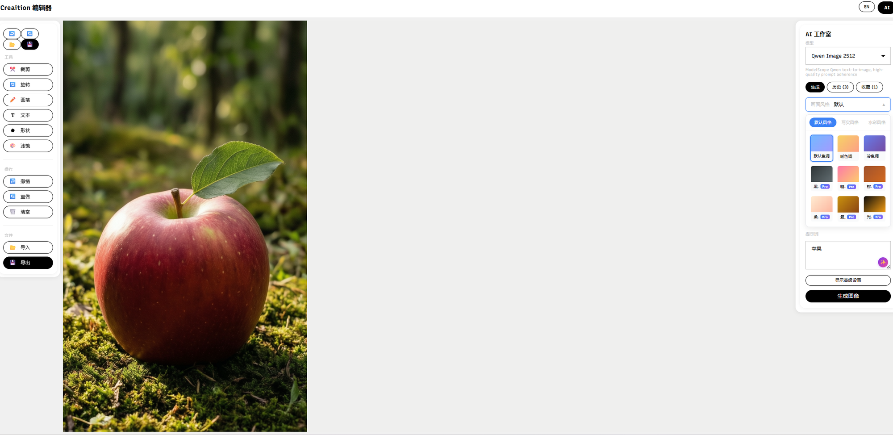
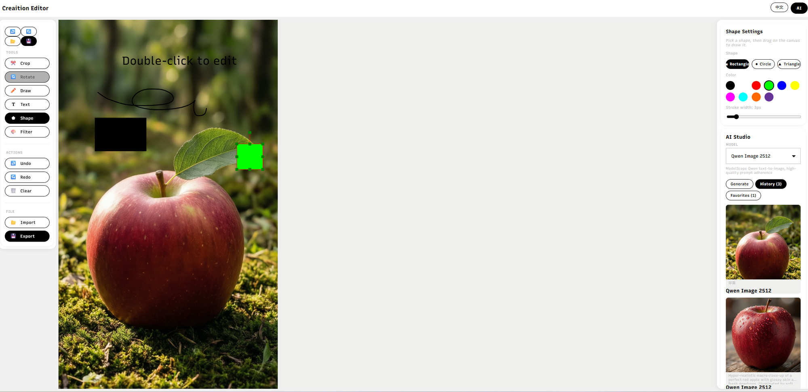
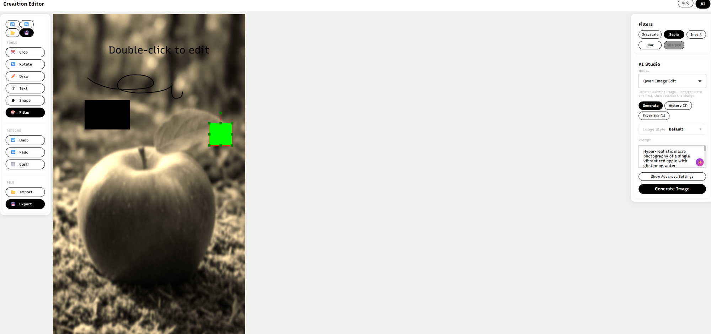

# Creaition 迷你图片编辑器

[English](./README.md) | **中文**

一个基于 Angular 17 的迷你图片编辑器，在 Toast UI Image Editor 之上集成了 **Creaition** 设计系统，并内置完整的 AI 图像生成工作室，接入 Hugging Face 推理 API（支持 Stable Diffusion XL、SD 1.5 和 Qwen Image Edit — 运行时可自由切换模型）。

> **在线演示：** _<部署后在此填写 Vercel/Netlify 地址>_



## 功能特性

### 第一部分 — 设计系统集成

- **Creaition 字体排版**：使用 Google Fonts 的 **Recursive** 可变字体（在 `index.html` 中加载），以品牌名称 `strokeWeight(var)` 作为别名。通过 `font-variation-settings` 驱动：
  - `wght`（设计令牌 60 / 80 / 120 映射到 Recursive 的 400 / 500 / 700）
  - `slnt` 轴实现悬停斜体效果
- 单色调色板：`#efefee`、`#bebebe`、`#f0f0f0`、`#ffffff`、`#000000`
- 50px 圆角按钮、0px 输入框、1rem 卡片
- 悬停动画在同一元素上过渡 `slnt` 轴，无需更换字体族
- 在 Toast UI Image Editor 的 CSS 之上应用自定义样式覆盖
- 集成 Angular Material 用于错误提示 `MatSnackBar` 弹窗，主题覆盖定义在 `creaition-theme.scss` 中

### 第二部分 — AI 生成 + 状态管理

- **多 AI 模型**（下拉框运行时切换）：
  - Stable Diffusion XL (`stabilityai/stable-diffusion-xl-base-1.0`)
  - Stable Diffusion 1.5 (`runwayml/stable-diffusion-v1-5`)
  - Qwen Image Edit (`Qwen/Qwen-Image-Edit`)
- **文生图**、**图生图**（以当前画布作为源图）和**图像增强**（通过 prompt 引导的 img2img 实现放大/细节增强）
- **批量生成** — 每次请求最多 4 张图，每项引导比例（guidance scale）不同以产生多样化结果
- **提示词建议** — 分类标签 + 防抖自动补全，基于精选提示词库
- **RxJS 状态管理**：通过 `BehaviorSubject` 实现；派生可观察对象包括 `generationState$`、`progress$`、`error$`、`selectedModel$`、`batchProgress$`
- **历史记录 + 收藏夹**：有容量上限、配额安全的 `localStorage` 持久化（在 `QuotaExceededError` 时丢弃一半历史记录并重试）
- **用户偏好设置**（模型、尺寸、步数、引导比例、批量数、img2img 开关、负面提示词）与历史记录分开存储，刷新页面后滑块设置不丢失
- **错误重试**：错误横幅和 `AiStateService.retryLast()` API 可重放上次请求
- **指数退避重试**：针对 HTTP 429（速率限制）和 503（冷启动）：1s → 2s → 4s，使用现代 RxJS `retry({ delay })` 运算符实现
- 加载体验：进度条（跨批次聚合）、骨架屏预览方块、每项批次计数器、错误时的 `MatSnackBar` 弹窗

### 响应式设计

移动优先，使用设计系统断点：

| 令牌 | 宽度 | 行为 |
|---|---|---|
| `sm` | ≤ 640px | 操作按钮堆叠，标题栏精简，图片网格 → 2 列 |
| `md` | ≤ 768px | 工具栏折叠到菜单切换按钮后，右侧边栏变为抽屉，属性面板变为**标题栏下方的全屏模态框**，由 `[isMobileVisible]` 驱动 |
| `lg` | ≤ 1024px | 工具按钮标签折叠为图标 |
| `xl` | ≤ 1280px | 侧边栏宽度逐步缩小 |

## 技术栈

| 层级 | 选型 |
|---|---|
| 框架 | Angular 17（独立组件） |
| 图片编辑器 | Toast UI Image Editor 3.15（CDN 加载） |
| 可变字体 | Google Fonts Recursive（CDN 加载，SCSS 中设置别名） |
| 样式 | SCSS + CSS 自定义属性 |
| UI 组件库 | Angular Material 17（MatSnackBar） |
| 状态管理 | RxJS `BehaviorSubject` |
| HTTP | `provideHttpClient()` + 类型化服务 |
| AI 后端 | Hugging Face 推理 API（Bearer 认证） |

## 项目结构

```
src/
├── app/
│   ├── components/
│   │   ├── image-editor/          # TUI Image Editor 包装组件（仅公共 API）
│   │   ├── toolbar/               # 工具 + 操作按钮，Creaition 风格
│   │   ├── properties-panel/      # 画笔 / 滤镜 / 裁剪 / 旋转 / 文字 / 形状
│   │   └── ai-generation-panel/   # 提示词、模型选择、img2img、批量、历史
│   ├── services/
│   │   ├── ai-image.service.ts       # HF 传输层（重试 + 退避）
│   │   ├── ai-state.service.ts       # RxJS 存储 + 生成工作流
│   │   ├── ai-preferences.service.ts # localStorage 支持的用户设置
│   │   └── prompt-suggestion.service.ts
│   ├── models/
│   │   └── ai-generation.model.ts    # ModelConfig、AI_MODELS、状态形状
│   ├── app.component.*               # 布局 + 组件间协调
│   └── app.config.ts
├── environments/                     # aiApiUrl + aiApiToken（占位符）
├── styles/
│   └── creaition-theme.scss          # 令牌、按钮、输入框、卡片、断点
├── index.html                        # CDN 加载（TUI、Recursive 字体）
└── styles.scss                       # 全局重置 + TUI 样式覆盖
```

## 安装运行

### 环境要求

- Node.js ≥ 18
- npm ≥ 9

### 安装与启动

```bash
git clone <仓库地址>
cd mini-image-editor
npm install
npm start        # ng serve 运行在 http://localhost:4200
```

### API 配置

1. 从 <https://huggingface.co/settings/tokens> 获取令牌。
2. 打开 `src/environments/environment.ts` 并替换占位符：

   ```ts
   export const environment = {
     production: false,
     aiApiUrl: 'https://api-inference.huggingface.co/models/stabilityai/stable-diffusion-xl-base-1.0',
     aiApiToken: 'hf_你的令牌'
   };
   ```

3. **切勿提交真实令牌。** 在生产/CI 环境中，应在构建时注入（例如在 CI 流水线中运行 `ng build` 之前，通过 `HF_TOKEN` 环境变量写入 `environment.prod.ts`）。

### 测试

```bash
npm test                        # Karma + Jasmine，监听模式
npm test -- --code-coverage     # HTML 覆盖率报告在 coverage/ 目录
```

测试套件覆盖 `AiImageService`、`AiStateService`、`AiPreferencesService`、`PromptSuggestionService`，以及所有四个组件的行为测试。

## 部署（Vercel）

仓库附带的 `vercel.json` 配置：

- 运行 `npm run build -- --configuration=production`
- 服务 `dist/mini-image-editor/browser` 目录
- 将所有路由重写到 `index.html`（SPA）
- 对哈希静态资源发送长期缓存头

```bash
npm i -g vercel
vercel deploy       # 首次按提示操作；后续部署只需一条命令
# 或
vercel --prod
```

通过 Vercel 的环境变量 UI 设置 `aiApiToken`，并在构建时读取到 `environment.prod.ts` 中 — **不要**硬编码。

## 设计决策

1. **TUI Image Editor 使用 CDN 加载。** npm 包以 CommonJS 格式分发，与 Angular 17 的 ESM 优先构建管道不兼容。从 CDN 加载可保持包体积精简，避免 Babel 转换；代价是运行时网络依赖，对演示项目来说可以接受。已从 `package.json` 中移除 npm 包以避免重复加载。
2. **Recursive → strokeWeight(var)。** 设计规范中的品牌字体（"strokeWeight(var)"）是专有的。Google Fonts 的 Recursive 是一个具有相同轴（`wght`、`slnt`）的公开可变字体，在每个 font-family 回退链的顶部设置别名，用一个真实的、免费的替代品保留设计意图。
3. **选用 RxJS 而非 NgRx。** 一个只有三个领域关注点（状态、偏好、传输）的单页应用不需要 actions/reducers/effects 的繁重模式。`BehaviorSubject` + 选择器式 `map` 可观察对象以更少的代码提供相同的响应式体验。
4. **偏好设置与历史记录分离。** 历史记录体积大（base64 图片）且短期存在；偏好设置体积小（<1 KB）且长期保留。使用独立的 `localStorage` 键意味着一个服务的优雅降级（历史记录配额超限）不会影响用户的滑块设置。
5. **全部使用独立组件。** 更好的 tree-shaking，无 `NgModule` 样板代码，如果项目增长可以更容易地进行懒加载。
6. **通过 RxJS 7 `retry({ delay })` 实现重试。** 替代已弃用的 `retryWhen`，保持指数退避逻辑的声明式风格，并对不可恢复错误（429/503 以外的错误）短路退出。
7. **Angular Material — 精确使用。** 不采用完整的 Material 设计语言，仅使用解决实际问题的部分（`MatSnackBar` 用于错误弹窗），让 Creaition 令牌在 `creaition-theme.scss` 中覆盖其外观。
8. **通过偏向 img2img 进行增强**，而非使用专用放大模型，这使我们每次请求只使用一个 HF 端点，保持在免费配额内。

## 挑战与解决方案

| 挑战 | 解决方案 |
|---|---|
| Angular 17 + Toast UI Image Editor（CJS）不兼容 | 从 CDN 加载库；在包装组件中将 `tui` 声明为 `any` |
| `font-variation-settings` 轴与 Angular Material 默认值冲突 | 在 `creaition-theme.scss` 中对 `.mat-mdc-*` 选择器使用 `!important` 显式覆盖 |
| HF 免费层冷启动（503 约 20 秒） | 指数退避重试（1s → 2s → 4s）+ 模拟进度条在等待期间渐进到 90%，成功后跳至 100% |
| Base64 历史记录填满 `localStorage`（约 5MB 上限） | `MAX_HISTORY = 30` + `QuotaExceededError` 处理器丢弃最旧的一半并重试一次 |
| 移动端属性面板静默不可见（之前的 bug） | 正确的 `[isMobileVisible]` 绑定来自 `AppComponent`，以及 `md` 断点以下的全屏模态框样式 |
| 模型间参数差异（如 Qwen 忽略 `negative_prompt`） | `ModelConfig.supportsNegativePrompt` 标志；UI 隐藏该字段，服务从请求载荷中省略 |

## 截图

### AI 生成面板（中文界面）

AI 工作室包含模型 / 画面风格 / 色调选择器和提示词输入框。右上角语言切换按钮可在英文与中文之间实时切换整个界面。


### 编辑工具 + 历史记录

形状、自由绘制、文字叠加与 AI 历史记录标签同屏展示。每张生成的图片都会进入历史面板，点击即可重新应用到画布。



### 滤镜 + Qwen Image Edit

Sepia 与 Sharpen 滤镜叠加到画布上，右侧选中 Qwen Image Edit 模型对现有图像进行提示词驱动的二次编辑。



## 许可证

MIT
